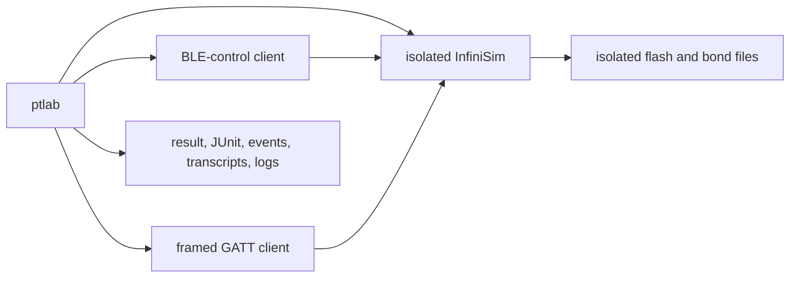

# PineTime lab

`ptlab` is the orchestration layer for the local PineTime family workspace. It
discovers sibling repositories, manages isolated simulator processes and run
artifacts, and verifies the shared companion protocol. Product and protocol
logic remain in InfiniTime, InfiniSim, and PineTimeCompanion.

## Python setup

Python 3.12 or newer and [uv](https://docs.astral.sh/uv/) are required.

```sh
uv sync
uv run ptlab protocol check
uv run ptlab list
uv run ptlab run --target sim --suite bond-lifecycle
uv run ptlab run --target sim --suite all --filter fast
uv run ptlab sim start
uv run ptlab sim status
uv run ptlab sim stop
uv run pytest -q
```

Pass `--workspace-root /path/to/workspace` before the subcommand when the four
repositories do not share the default parent directory. Each selected scenario
starts a separate InfiniSim process with dynamically allocated GATT and
loopback BLE-control ports. Fast suites use `SDL_VIDEODRIVER=dummy` and require
no X server. Process groups are stopped after pass, failure, or timeout.



## Scenario matrix

| Suite or command | Mode | Fidelity |
|---|---|---|
| `bond-lifecycle` | headless, virtual time | Real portable bond codec/coordinator through control plus the built adapter regression for exact forget-all invariants; deterministic virtual identities and security fixtures |
| `radio-policy` | headless, virtual time | Endpoint transitions plus the built portable radio regression for off/on, health cadence, and command ordering; no RF |
| `link-auth` | headless | Real generated access policy and firmware GATT callbacks over injected virtual link security; no SMP |
| `persistence-faults` | headless, virtual time | Real codec and atomic file replacement at named staged-write boundaries |
| `family-handoff` | headless | Real schedule/task firmware services through independent A→B→A GATT sessions |
| `protocol-regression` | headless | Existing full schedule, prayer, beacon, CTS, alert, and bridge regression |
| `dfu` | headless | Real legacy DFU init parser and notification path through the shared Python framing |
| `raw-flash-power-loss` | headless | SIGKILL plus real littlefs active/staging files and reboot cleanup |
| `./reminder-fire-test.sh` | Xvfb, true timer | Real UI/sleep reminder timer and screenshots |
| `./prayer-fire-test.sh` | Xvfb, true timer | Real UI/sleep prayer timer, persistence, and screenshots |
| `./prayer-fajr-test.sh` | Xvfb, true timer | Real all-but-Fajr UI/sleep timer behavior |

`all --filter fast` selects the five deterministic suites. Repeated `--filter`
options narrow by suite name, description, or tag. The timer scripts remain
separate because replacing their sleep/UI timers with virtual policy time
would bypass the behavior they validate.

Virtual peers are opaque deterministic test identities. `BONDED` and
`AUTHENTICATED` are injected link states, not pairing or Security Manager
Protocol exchanges. Advertising transitions and GAP outcomes are policy
events, not radio-frequency behavior. Flash counts, byte counts, and
persistence wake-lock duration are software proxies, not current or energy
measurements.

## Physical acceptance

Install the optional BlueZ/Bleak dependencies before using a real watch:

```sh
uv sync --group hardware
```

`hardware probe` uses a fresh Linux BLE identity to prove the protected verify
characteristic rejects an unpaired read, then completes normal authenticated
pairing, reads the protected verify value, enables the battery CCCD,
disconnects, and proves the CCCD value restores on the next connection.

```sh
uv run ptlab hardware probe \
  --address AA:BB:CC:DD:EE:FF \
  --adapter hci0
```

The pairing dialog is owned by BlueZ. Configure a normal interactive BlueZ
agent before the probe when the desktop does not already provide one. A probe
against a full five-peer watch can evict the least-recently-used peer, exactly
like any other new companion. The probe refuses that pairing unless
`--allow-eviction` is supplied explicitly. Remove the watch from BlueZ or use a
different adapter identity before the negative authentication check. Use
`--skip-auth-negative` only for a repeated diagnostic against an already-bonded
central; that run does not prove the authentication gate rejects a fresh peer.

Use `hardware accept` for the family handoff test. Copy
`hardware-plan.example.json`, spell every ADB serial, BLE address, and adapter
exactly, and list the intended connection order. Linux steps are automatic.
Android steps launch the installed companion through ADB, capture narrowly
filtered Bluetooth evidence, and require an explicit operator result after the
battery read. The runner never calls a hidden Android bond-removal API.

```sh
uv run ptlab hardware accept --plan /path/to/family-watch.json
```

For the five-peer/sixth-peer LRU test, add six independent peers and this object
to the plan. The operator must test the evicted peer without repairing it:

```json
{
  "capacity_check": {
    "survivor": "parent-a",
    "evicted": "parent-b",
    "new_peer": "sixth-device"
  }
}
```

Long-idle advertising is a passive visibility test:

```sh
uv run ptlab hardware advertise \
  --address AA:BB:CC:DD:EE:FF \
  --duration 86400 \
  --interval 900 \
  --scan-window 10
```

The side-by-side soak connects to the candidate and upstream watch only for
endpoint battery readings. Between those reads it scans both watches in the
same BlueZ windows so the comparison sees the same host and environment.

```sh
uv run ptlab hardware soak \
  --candidate-address AA:BB:CC:DD:EE:01 \
  --baseline-address AA:BB:CC:DD:EE:02 \
  --adapter hci0 \
  --duration 604800 \
  --interval 3600 \
  --scan-window 10
```

Hardware results are private (`0700`) JSON artifacts under
`.ptlab/hardware/` unless `--output` is provided. Battery percentages are coarse
watch telemetry and advertising samples prove visibility only. Neither is an
electrical-current or RF-power measurement; use a controlled current fixture
for absolute power claims. Acceptance and soak results are atomically
checkpointed after each completed step or scan window, so a late disconnect
retains the evidence already collected.

## Run artifacts

Every scenario creates a private directory under `.ptlab/runs/`:

| Artifact | Contents |
|---|---|
| `result.json` | status, duration, check/failure counts, ports, simulator state, repository SHAs, and artifact paths |
| `junit.xml` | one testcase per recorded assertion plus scenario errors/timeouts |
| `events.ndjson` | ordered lifecycle, command, assertion, failure, and cleanup events |
| `transcript.ndjson` | GATT request/response/notify and BLE-control command/response records with payload hex |
| `logs/` | simulator stdout/stderr and external command output |
| `run/` | simulator working directory and live virtual bond persistence |
| `flash/` | emulated SPI flash plus copied bond persistence evidence |
| `shots/` | screenshots for suites that exercise the UI |

Failure and timeout results retain logs, transcripts, raw flash, and available
`.bin`/`.bin.next` persistence evidence. Repository records contain the SHA and
dirty flag for every family checkout.

## Cross-repository CI

`.github/workflows/cross-repository.yml` resolves the requested InfiniTime,
InfiniSim, PineTimeCompanion, and pinetime-dev-tools refs to immutable SHAs
before checking out any repository. Manual runs expose all four refs; push and
pull-request runs use the current dev-tools event SHA plus the documented
family branch defaults for the other repositories.

The workflow checks all generated protocol outputs, builds and tests firmware
host logic and InfiniSim, runs companion type checks, TypeScript tests, pure
Kotlin tests, and web export, then runs every deterministic headless `fast`
scenario. Scenario result files, logs, transcripts, persistence evidence, and
JUnit XML are uploaded on both success and failure.

The coordinated prerelease and physical fleet gates are specified in
[`RELEASE.md`](RELEASE.md).

## Layout

| Path | What it is |
|---|---|
| `../InfiniTime` | **Your fork** — firmware source. This is where apps get written. |
| `../InfiniSim` | Your fork of the simulator. Builds the firmware source into a desktop binary. |
| `src/ptlab/` | Reusable orchestration, lifecycle, allocation, and artifact modules. |
| `simctl.py` | Backward-compatible wrapper for existing simulator commands. |
| `shots/` | Captured screenshots (240×240 PNGs of the watch screen). |
| `run/` | Simulator working dir: emulated SPI flash, `sim.log`. |

InfiniSim vendors its own copy of InfiniTime at `InfiniSim/InfiniTime/` (a submodule
pointing at upstream). We ignore it: the build is configured with
`-DInfiniTime_DIR="$(cd ../InfiniTime && pwd)"` so it compiles **your fork**.
If the sim ever seems to ignore your changes, check that setting first:

```sh
grep InfiniTime_DIR ../InfiniSim/build/CMakeCache.txt
```

## Workflow

```sh
./simctl.py start          # boot the sim on a hidden virtual display (Xvfb)
./simctl.py rebuild        # compile the fork + restart the sim — the inner dev loop
./simctl.py shot name      # capture the watch screen -> shots/name.png
./simctl.py awake          # wake the screen ONLY if it's off (state-aware, reads sim.log)
./simctl.py stop
./simctl.py kill           # SIGKILL, no graceful stop: power-loss simulation
```

The compatibility simulator starts the **TCP GATT bridge** on port 18632
(`--bridge-port` to change) and allocates a separate BLE-control port. Scenario
runs allocate both ports dynamically. The watch's BLE characteristics are
served over TCP, so companion-app code and tests can talk to the simulated
watch with real protocol bytes. `node bridge-test.mjs`
is the standing protocol regression (schedule sync incl. 64-event, out-of-order and
disconnect-mid-sync cases, digest, event read-back, violation handling, CTS
time-travel, notifications, battery, prayer settings, Find My beacon provisioning)
— run it after firmware protocol changes. The virtual endpoint exercises radio
policy transitions but does not simulate RF or SMP.

Scenario compatibility commands:
`./powerloss-test.sh` runs the isolated `raw-flash-power-loss` suite, which
kills the sim mid-sync and proves (littlefs-do post-mortem)
that the active schedule survives and the partial staging file is cleaned up at
boot; `./reminder-fire-test.sh` (~2 min) proves a schedule reminder fires from
sleep with combined same-second titles and that dismiss works;
`./prayer-fire-test.sh` (~4 min) writes prayer settings, warps the clock to just
before a prayer, and proves the alert fires from sleep (RAM-only path, flash
tripwire armed), dismiss reschedules, settings survive a reboot, and alerts-off
suppresses the alert.

`simnav.py` is a screenshot-verified UI navigator (with retries) that codifies
the two sim input gotchas: key-injected swipes and button wakes don't reset
LVGL's idle-activity clock, so blind tap sequences randomly hit sleep; and the
reliable way home from any state is to hold the button until the Screen-is-OFF
overlay shows, then wake.

`companion-cli.mjs` is a second companion (and the computer-syncing story): it speaks the
same wire protocol through the bridge, so you can drive a two-device scenario locally.

```sh
node companion-cli.mjs list
node companion-cli.mjs add "Quran practice" 17:00 weekly Mon,Wed,Fri
node companion-cli.mjs delete "Quran practice"
```

`build-asan/` in InfiniSim is an AddressSanitizer build (`LD_PRELOAD` libasan to run);
a wake/sleep stress loop under it is the regression test for the LVGL thread race fixed
in `sim/displayapp/LvglGuard.h`.

Driving the watch:

```sh
./simctl.py tap 120 120         # touch, in watch coords (0-239)
./simctl.py drag 120 200 120 40 # press-move-release swipe
./simctl.py swipe up            # gesture shortcut (up/down/left/right)
./simctl.py button              # hardware side button (back / wake)
./simctl.py button --hold 2000  # long press
./simctl.py key notify          # simulate an event, see aliases below
```

Event aliases: `ring`, `unring`, `buzz`, `notify`, `clear-notify`, `ble-connect`,
`ble-disconnect`, `battery-up`, `battery-down`, `charging`, `not-charging`,
`brightness-up`, `brightness-down`, `steps-up`, `steps-down`, `heartrate`,
`heartrate-stop`, `weather`, `clear-weather`. Any raw InfiniSim hotkey also works
(`./simctl.py key i`).

The screen sleeps on its own; use `./simctl.py awake` (only presses the button when
the screen is actually off — a blind `button` on a live watchface puts it to sleep).
When driving multi-step UI flows, chain the steps in one shell command: per-command
latency is longer than the watch's display timeout.

## Why input is "held"

InfiniSim polls `SDL_GetKeyboardState` / `SDL_GetMouseState` once per LVGL refresh
(~30 ms) rather than consuming SDL events. An instant xdotool click or keystroke
lands between two polls and is silently dropped. `simctl.py` therefore holds every
input ~150 ms. If you drive the sim by other means, do the same.

## First-time setup (already done)

```sh
sudo apt install -y xvfb xdotool xauth        # only step needing root
cd ../InfiniSim && npm install lv_font_conv@1.5.2
cmake -S . -B build \
  -DInfiniTime_DIR="$(cd ../InfiniTime && pwd)" \
  -DWITH_PNG=ON -DBUILD_RESOURCES=ON -DMONITOR_ZOOM=1 -DCMAKE_BUILD_TYPE=Debug
cmake --build build -j$(nproc)
```

`MONITOR_ZOOM=1` keeps window pixels 1:1 with watch pixels, so screenshot
coordinates and tap coordinates are the same numbers. `simctl.py` handles other
zoom levels, but 1 keeps things simple.

## Writing an app

An InfiniTime app lives in `../InfiniTime/src/displayapp/screens/`, is registered in
`src/displayapp/apps/Apps.h.in` + `UserApps.h`, and gets instantiated in
`DisplayApp.cpp`. To control which apps are compiled in, configure the sim with
`-DENABLE_USERAPPS="Apps::Timer,Apps::Alarm,..."`.
